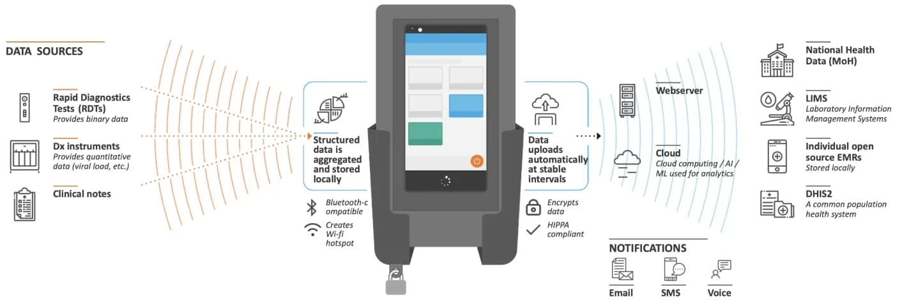
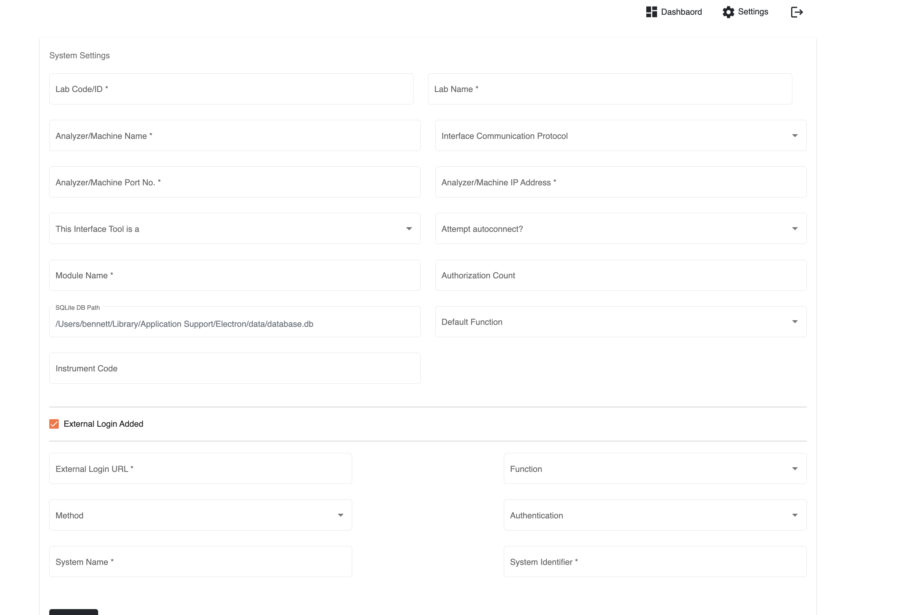

COVID-19 has highlighted the importance of having public laboratories efficiently integrated with the rest of the healthcare architecture. It’s been shown through numerous case studies that connecting labs with the country’s health information exchanges (HIEs) significantly facilitates critical activities such as disease surveillance, notification of test results, reporting to stakeholders, and inventory control. It follows that DHIS2 can play a pivotal role in these use cases. Imagine the national Health Management Information System (HMIS) displaying the daily tally of new positive tuberculosis cases on its dashboard as soon as the test results are available at the lab, or a surveillance system notifying patients of their results. Another innovative use case gaining traction is for DHIS2 to collect the state of lab diagnostics (i.e., error rates, usage frequency, online status, etc…) in order to simplify their management.
<!-- truncate -->

_A typical public lab (source: https://drdollah.com/laboratory-information-system-lis/)_

HISP Centre, for the past year or so, has been exploring the lab integration space to understand what’s been done so far, the challenges, and how it can be improved. A major hurdle we identified to seamlessly integrate labs with health systems is that labs around the globe have technicians, receptionists, and other personnel manually punching in data, copying and filtering spreadsheet rows, mapping test requests and results, and double-checking data for quality control. This is especially true for low and middle-income countries (LMICs). In the initial COVID-19 testing response, such work practices couldn’t keep up with the volume of test requests and turnaround time suffered as a result. A number of countries couldn’t allow this state of affairs to continue therefore initiatives were created to partially or fully digitise their lab workflows. We’ve seen success stories in these initiatives. In Rwanda, [for example](https://dhis2.org/rwanda-covid-lab-integration/), [HISP Rwanda](https://hisprwanda.org/) developed an application for the national reference lab that validates COVID-19 test orders at the reception stage followed by validation of test results prior to transmitting these results to Rwanda's DHIS2 Tracker COVID-19 surveillance instance. The application didn’t fully manage the workflow (e.g., spreadsheets were still shared out-of-band) as witnessed during our on-site visit but enough of the workflow was digitised to substantially reduce test turnaround time.

_Dashboard of Rwanda’s LIS (source: HISP Rwanda)_

What Rwanda created is a bespoke Laboratory Information System (LIS). Note that sometimes an LIS is referred to as a Laboratory Information Management System (LIMS[^1]) though there are subtle differences between the two which won’t be discussed here for brevity purposes. As the name implies, a LIS is an information system geared towards supporting lab operations. It manages workflows, with varying levels of automation, and primarily collects lab data which then can be queried and shared with applications like an Electronic Medical Record (EMR). It might be tempting to think that it’s a no-brainer for every lab to have an LIS. After all, such an application will help the integration of the lab data with the wider health ecosystem. The truth of the matter is that, based on our landscape analysis, a substantial number of  lab sites are underfunded and lack the IT resources (i.e., staff, hardware, etc…) to operate an LIS on-premise. In fact, an open-source LIS called [LabBook](https://www.lab-book.org/en/) tries to reduce this problem by shipping the LIS as an ISO image. To avoid costly licence fees, the image is an Ubuntu operating system which has installed the LIS itself, an automated backup system, an antivirus, a firewall, and also an IM application. In theory, all a user needs to get started with LabBook is to import the image into a virtual environment (e.g., [VirtualBox](https://www.virtualbox.org/)). Not even an Internet connection is required.

An off-premise LIS reduces the need for IT capacity at the lab facility. IT resources are pooled into a single site to operate a central LIS that labs would connect to. What about labs with limited or no connectivity? These labs would be left behind unless some offline approach is devised such as shipping the lab data to the centralised LIS for import or manual entry. Offline functionality is the rationale behind [edgeDx Node](https://edgedx.net/). Node is an LIS supporting lab sites that do not have stable Internet connectivity. Diagnostic data from multiple sources is captured on an Android device that Node is managing. The device’s mobility allows employees, while performing their duties, to easily carry it around the lab and interact with it. When the device (re)joins the network, the diagnostic data is reconciled with the Node server. Apart from offline functionality, Node brings with it a plethora of features including device management as well as interoperability with DHIS2 and a variety of lab machines. The latter is a topic which will be touched on later in this post.

_A Node device (source: https://edgedx.net/product/5fab511a00f47d13e8c8dd3e)_

Another barrier we’ve identified with LIS adoption is that not all labs operate the same way. Lab X may filter out positive test cases for retesting while lab Y doesn’t. Lab X could also be validating the results in batches whereas lab Y is validating them individually. The challenge is how to have an LIS that can cater for all these possible workflows, data flows, and types of data but at the same time be simple enough so that implementers don't struggle while customising it.
The software team at HISP Centre is walking this very same tight rope for DHIS2! Some may argue that lab personnel should adapt their processes to the LIS’s “best practices” and not the other way around. The counterargument is that an opinionated LIS will meet resistance in its implementation and will likely be dropped at the first opportunity.

_Customisation on Senaite (source: https://www.senaite.com/docs/quickstart)_

The merits of implementing an LIS with DHIS2 Tracker should be considered. Proponents say that Tracker, with its customisable programs, offline support, vibrant community, and large footprint in many LMICs, is an ideal LIS stop-gap solution for a lab’s digitalisation journey. However, an LIS DHIS2 implementation, to be efficiently integrated with the HIE, has to communicate with lab equipment, EMRs, HISs (hospital information systems), and so on. Weak interoperability of LISs has been a common theme in all our findings. Taking lab machines (a.k.a. analysers) as an example, we’ve reached the unfortunate conclusion that open-source LISs, at most, are interoperable with a fraction of the lab machines on the market. Lab machine communication interfaces are heterogeneous, especially across vendors. Instruments receive and send test data using proprietary or public messaging standards like HL7v2, ASTM, and CLSI LIS2-A2. To this day, there isn’t a universally accepted interoperability standard governing lab machines. Adding to the complexity, analysers from different vendors talking in the same format doesn’t necessarily mean that they can be communicated with in the same manner. Let’s consider HL7v2. HL7v2 comes in versions which means analysers can be using any number of HL7v2 versions to exchange data. Incompatibilities might emerge between the versions therefore an LIS can't assume it's interoperable with all analysers which speak HL7v2 just because it can parse a particular version of HL7v2. Hold on, that’s not all. Within the same HL7v2 version, the vendor could be using their own flavour of HL7v2. If this is not sufficient, we have to contend with the different terminologies employed across the instruments. This last point is of special relevance when creating aggregate reports. We haven’t gotten started with the medium carrying the data. Serial? Ethernet?

Compounding the interoperability problem is the numerous accounts we heard of the difficulty in obtaining integration manuals from the analyser vendors. We also heard of how cumbersome it’s for LIS software engineers to test the analyser integration. Lab analysers are unlike today’s modern mobile phones. Engineers don’t have the luxury to test against an analyser emulator. Instead, they need to physically sit next to the machine and test the integration. One may start to appreciate why lab machine interoperability is a tough nut to crack.

Parallel initiatives are ongoing to improve LIS interoperability with lab machines. In one such initiative, the [OpenELIS](https://openelis-global.org/) team developed, into their LIS, the ability to use [Open Concept Lab](https://openconceptlab.org/) (OCL) as a terminology service in order to standardise (e.g., [LOINC](https://openconceptlab.org/)) the nomenclature across machines. We came across one or two initiatives attempting to standardise lab machine communication though standardisation is not the only path to achieving interoperability with lab machines. Our colleagues at [University of Dar es Salaam (UDSM) DHIS2 Lab](https://dhis2.udsm.ac.tz) have recently [open-sourced the bits of software](https://github.com/udsm-dhis2-lab/machine-interfacing) that obtains test results directly from their lab instruments. With enough contributions and interest, this middleware may become a practical low-cost sustainable approach to integrating an LIS and other health systems with lab equipment. Presently, the project provides integration for only a limited number of lab machine models.

_UDSM's lab machine middleware config page (source: https://github.com/udsm-dhis2-lab/machine-interfacing/blob/main/README.md)_

Time will tell whether these initiatives will succeed but past experience suggests that a lot of investment and collaboration between the main actors is needed before these initiatives can start bearing fruit. On the other side of the coin, interoperability between LISs and health systems has arguably been more successful thanks to FHIR. Case in point is [OpenELIS being able to exchange data with OpenMRS](https://digitalsquare.org/blog/2020/6/24/fhir-based-interoperability-solution-for-openelis-and-openmrs), an EMR, using a FHIR workflow. It remains to be seen which EMRs, aside from OpenMRS, can replicate this interoperability with OpenELIS using FHIR. Continuing on the subject of health system interoperability, it’s uncertain how the interoperability between an LIS and an HMIS, a common DHIS2 use case, should look like. Is it the role of the LIS to aggregate the lab data and deliver it in its aggregate form to the HMIS? If so, there are standards like [Aggregate Data Exchange](https://wiki.ihe.net/index.php/Aggregate_Data_Exchange) (ADX) and FHIR’s [Mobile Aggregate Data Exchange](https://wiki.ihe.net/index.php/Mobile_Aggregate_Data_Exchange_(mADX)) (mADX) that may act as the bridge between the LIS and the HMIS. Alternatively, is it the role of the HMIS to aggregate the lab data? Then it’s less clear for LIS engineers on what standards to follow. It’s possible that FHIR may help but more work is needed on this front to develop the necessary guidelines.

What’s your experience with lab integration? What did we miss? How can it be improved? Do you have an LIS DHIS2 implementation or are you planning to roll out one? We’d love to hear your thoughts at [DHIS2’s community of practice](https://community.dhis2.org/).

[^1]: Not to be confused with an LMIS which is a Logistics Management Information System

