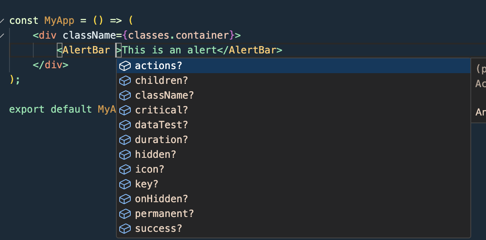

We're pleased to announce the release of UI 9, which includes support for TypeScript. All the UI components and forms now have type definitions, which will make it easier to use UI in TypeScript projects, or have better auto-completion in JavaScript projects.

<!--truncate-->

First things first, UI 9 is an easy upgrade from UI 8, however it does have a breaking change. Which is why the major version was bumped. 

## Breaking Change
The breaking change is, as specified in the releases page on GitHub:

**constants**: `buttonVariantPropType` has been removed from constants. This is mostly intended for internal use, but was part of the public API prior to this release.

## TypeScript Support
Now comes the fun part of this release. There's TypeScript support for all UI components. This won't just benefit you when you're using TypeScript either. If you're using JavaScript, you'll get better auto-completion and type checking in your IDE.

## Upgrading to version 9
At the moment of writing, the latest version of the UI Library is v9.0.1. To upgrade to this version, you can run the following command on your existing React application.

```bash
yarn install @dhis2/ui
```

Running this command will bump the your React Application to use the latest version of the UI Library, and with that you should have this in your `package.json`:

```json
  "dependencies": {
    "@dhis2/ui": "^9.0.1"
  }
```

## Using Auto-Completion
In the examples below I'll be using VSCode, but most IDE's will have similar functionality.

Before, when using a version prior to 9.0.0, you'd get auto-completion like this:


But once upgraded, you will see the following:



As you can see, there's many properties autocompleted for which you previously had to either remember they existed, or reference the [documentation](https://ui.dhis2.nu/). But now you no longer have to. 

But it gets better. If you select one of the properties from the autocomplete, you'll get a description of what it does:


