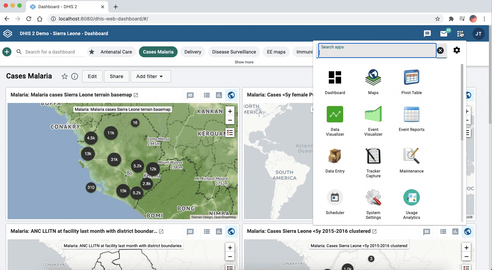

If you encounter some errors when trying to connect to your application or during development, please try the following troubleshooting steps:

## CORs allowlist

If you run into Cross-Origin Resource Sharing (CORs) policy issues when connecting to your server, you could start with the **CORs allowlist**.

### What is the CORs allowlist?

In a DHIS2 instance, by default only web applications that are running on the same URL can access that DHIS2 instance.

There's a **CORs allowlist** option that can be configured to add other URLs besides the current one and allow that DHIS2 application instance.

### Where do I change it?

When you login to your instance, click on the apps icon and search for **System Setting** application. Then go to **Access** from the menu on the left and scroll down to see the **CORs allowlist** option.

There you can add the URLs that you want to grant access. The settings will be automatically updated by tabbing out of that.

See below:



## If you're using Chrome

There are a few things that you could do if you're using Chrome and the problem persists:

### Disable SameSite by Default Cookies

To check your current Google Chrome version: click on the three dots menu > Help > About Google Chrome > Your Chrome version number will be displayed.

#### Chrome 90 and earlier versions

Disable the default SameSite Cookies behavior in Chrome by setting the "SameSite by default cookies" flag [chrome://flags/#same-site-by-default-cookies](chrome://flags/#same-site-by-default-cookies) to **Disabled**.

You may need to restart your browser to apply the new setting.

#### Chrome version 91

The flags `#same-site-by-default-cookies` and `#cookies-without-same-site-must-be-secure` have been removed from chrome://flags as of Chrome 91, as the behavior is now enabled by default. [Learn more here](https://www.chromium.org/updates/same-site)

**Disable using the command-line flag**:

You can mention flags that you need to disable on your terminal. Note that you will need to close all instances of Chrome that are running before executing the following commands:

1.  For Mac users:

```
/Applications/Google\ Chrome.app/Contents/MacOS/Google\ Chrome
--disable-features=SameSiteByDefaultCookies,CookiesWithoutSameSiteMustBeSecure
```

2. For Windows users:

```sh
Chrome Application Path
--disable-features=SameSiteByDefaultCookies,CookiesWithoutSameSiteMustBeSecure
```

:::note
**Note:** In Chrome 94, the command-line flag `--disable-features=SameSiteByDefaultCookies,CookiesWithoutSameSiteMustBeSecure` will be removed.
:::

> This disables legitimate security behaviors in your browser, so proceed with caution! We recommend that you only disable this flag when actively debugging a DHIS2 application.
> Read this blog to learn more about [SameSite Cookie Policies and DHIS2 Applications](/blog/cross-origin-cookies).

## If you're using Firefox

On the latest versions of Firefox when trying to connect your application to a DHIS2 instance you might now receive this error:

```
Cross-Origin Request Blocked: The Same Origin Policy disallows reading the remote resource at https://a_dhis2_instance/dev/dhis-web-commons-security/login.action. (Reason: CORS request did not succeed). Status code: (null)
```

This is because recently Mozilla [changed the SameSite Cookie behavior on Firefox](https://hacks.mozilla.org/2020/08/changes-to-samesite-cookie-behavior) to be a bit more strict. The previous default configuration allowed to send cookies with both cross-site and same-site requests (`SameSite=None`) while the in the new default configuration cookies will be withheld on cross-site requests (such as calls to load images or frames) but sent when a user navigates to the URL from an external site; for example, by following a link (`SameSite=Lax`).

If you're willing to soften your browser security for the sake of debugging you can work around this by typing [about:config](about:config) on a browser tab, searching for the `network.cookie.sameSite.laxByDefault` property and setting it to `false`.
However, you should exercise caution as this will leave users vulnerable to Cross-Site Request Forgery ([CSRF](https://developer.mozilla.org/en-US/docs/Glossary/CSRF)) attacks. In a CSRF attack, a malicious site attempts to use valid cookies from legitimate sites to carry out attacks.

### Disabling cache

You could also try disabling the cache from the network tab in Chrome DevTools. See below:


## Using DHIS2 Play instances

**DHIS2 Play instances**: [https://play.dhis2.org/](https://play.dhis2.org/) allow you to test out the DHIS2 platform using demo databases on the DHIS2 Play server.

If you try to connect your application on localhost to the DHIS2 Play server and encounter some errors, please note that DHIS2 Play instances use [nginx](https://nginx.org/) as a reverse proxy which has been configured for hardened security, preventing cross-site cookies completely.

To work around this issue during application development, run your own development instance of DHIS2 or spin up a local instance using Docker and the `d2 cluster` command of the [DHIS2 CLI](/docs/cli/cluster). Check [this guide](./spin-up-local-instance) on how to spin up a local instance.

## Node version

Make sure that you are running a compatible version of [Node.js](https://nodejs.org/en/download/), version 10 or later, as using older versions may throw some errors during setup.

## HTTPs Everywhere Extension

[HTTPs Everywhere](https://www.eff.org/https-everywhere) is a Firefox, Chrome, Opera extension created by EFF and the Tor Project which automatically switches thousands of sites from insecure "http" to secure "https".

If you use this extension in your browser and the **Encrypt All Sites Eligible** is set to **ON**, it will break and cause errors when using unencrypted http://localhost:3000 as the extension is trying to use https://localhost:3000 for CORS.

The best solution would be to disable the extension for `localhost`. Under **Settings for this site** click the button **Disable on this site**.

Setting the **Encrypt All Sites Eligible** to **OFF** should work as well. See below:


## Others?

Please let us know and we will continue adding those to the list 👌🏽
