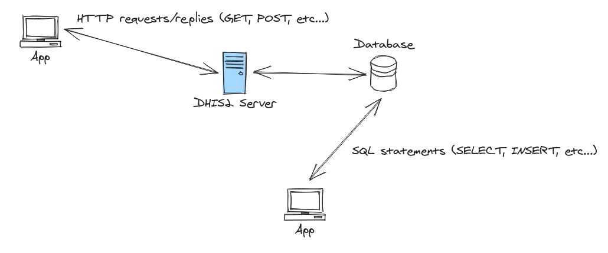
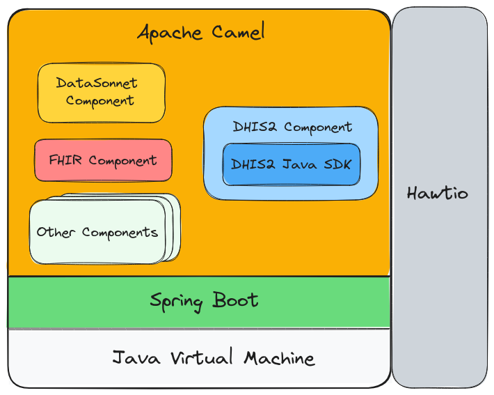

Applications interact with DHIS2 either through its [RESTful Web Application Programming Interface](https://docs.dhis2.org/en/develop/using-the-api/dhis-core-version-master/introduction.html) (API) or its PostgreSQL database. Such interactions include altering the DHIS2 metadata as well as querying, saving, and updating other data like events, data value sets, and so on. In the case of the Web API, these interactions are in the form of HTTP requests/replies where the content is typically described in JSON and the type of action is reflected in the HTTP method used, for instance, GET, POST, DELETE, etc... In the context of the database, these interactions are in the form of SQL statements like SELECT, INSERT, DELETE, etc...

Most applications, including the ones which are built on top of the [DHIS2 App Platform](https://developers.dhis2.org/docs/app-platform/getting-started/), exchange data with DHIS2 via its Web API. This interface is stable, governed by strict change control, and documented comprehensively. In fact, the API is formally described in [OpenAPI](https://www.openapis.org/). OpenAPI _defines a standard, language-agnostic interface to HTTP APIs which allows both humans and computers to discover and understand the capabilities of the service without access to source code, documentation, or through network traffic inspection_. In practical terms, having an [the DHIS2 Web API defined in OpenAPI](https://docs.dhis2.org/en/develop/core-openapi-specification.html) means that the interface is rigorously documented and API client libraries can be generated in a variety of programming languages like Python and TypeScript.

It is strongly recommended that applications integrate wth DHIS2 through the Web API. An application that reads from and writes directly into the database will likely lead to a brittle integration: the app is likely to break across environments or over time. Besides the Web API providing a formal contract between DHIS2 and the client, better tooling is offered such as the [DHIS2 Java SDK](dhis2-java-sdk.md) and the DHIS2 App Platform. 

The [DHIS2 integration & interoperability web page](https://dhis2.org/integration/) highlights the different technologies that can help you integrate DHIS2 into your architecture. The page also provides non-technical practical advice when formulating your integration & interoperability strategy together with links to integration code examples. Since a DHIS2 implementation is traditionally the cornerstone of an IT architecture, it is important to get its integration right the first time round. IT departments will have their own opinions on how to connect DHIS2 with the rest of their systems but, to help guide you through the integration labyrinth, we have identified a set of open-source technologies that closely align with our [principles](https://www.mn.uio.no/hisp/english/networks/) (e.g., _commit to free and open source software and standards_) and can form a solid technical foundation to your integration:

The above diagram conceptualises this set of technologies as a stack. We suggest that you re-visit this page from time to time. This stack is continuously evolving since it is a living and breathing thing. What follows is a brief description about each layer of the stack:

* Java is the underlying platform from which everything else in the stack is running on. Java has an excellent ecosystem, well-understood, and has plenty of expertise revolving around it. 

* [Sprint Boot](https://spring.io/projects/spring-boot/) wires all the bits and pieces of an application into a cohesive whole. It is considered the go-to dependency injection framework and recommended for projects with a lot of moving parts.

* [Apache Camel](https://camel.apache.org/) is a Java framework for building sustainable message-oriented middleware. It codifies enterprise integration patterns and comes packed with modules that add support for various data formats, protocols, libraries, and services. Among these are modules for supporting DHIS2, CSV, JSON, XML, JMS, Apache Kafka, FHIR, JDBC, and HL7v2. Apache Camel is a battle-tested, mature project with a vibrant community behind it and substantial tooling to aid development and server operations. Visit the [Apache Camel page on the DHIS2 Developer Portal](/docs/integration/apache-camel) to learn more.

  * [DHIS2 Component](https://camel.apache.org/components/4.0.x/dhis2-component.html) leverages the DHIS2 Java SDK to integrate Apache Camel with DHIS2. Visit the [Camel DHIS2 Component page on the DHIS2 Developer Portal](/docs/integration/camel-dhis2-component) to learn more.
  
    * [DHIS2 Java SDK](https://github.com/dhis2/dhis2-java-sdk) is a lightweight library that hides the nuts and bolts of DHIS2 Web API interactions behind a fluent Java API and type-safe resource models. Visit the [DHIS2 Java SDK page on the DHIS2 Developer Portal](/docs/integration/dhis2-java-sdk) to learn more.
    
  * [DataSonnet Component](https://camel.apache.org/components/4.0.x/languages/datasonnet-language.html) applies JSON-extended templates to data in order to map it to a different structure (e.g., JSON to JSON) or transform it to a different format (e.g., JSON to XML). [DataSonnet](https://datasonnet.com/) is an extension of [Jsonnet](https://jsonnet.org/) and lends very well to the DHIS2 and FHIR JSON formats.
  
  * [FHIR Component](https://camel.apache.org/components/4.0.x/fhir-component.html) gives Camel the capability to exchange data with FHIR servers like HAPI FHIR. Combining the DHIS2 and FHIR components in your Camel solution effectively allows you to build a FHIR facade for DHIS2.

* [Hawtio](https://hawt.io/) is an extensible monitoring and management solution designed for Java programs. Among the many plugins, it has plugins for Apache Camel and Spring Boot.